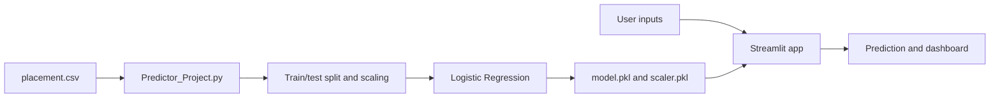

# Placement Predictor

A small machine-learning web application that estimates placement likelihood from two numeric inputs: CGPA and IQ. The project includes a model-training script, a saved logistic-regression model and scaler, a Streamlit interface, and the sample placement dataset.

> **Use responsibly:** This is an educational demonstration built from a small dataset. Its output is not a hiring decision or a reliable prediction about an individual's future.

## Features

- Streamlit interface for entering candidate values and viewing a prediction.
- Logistic Regression classifier trained on CGPA and IQ.
- StandardScaler fitted on the training split and reused at inference.
- Dataset summary metrics shown alongside the prediction.

## Architecture



`Predictor_Project.py` reads the CSV, selects CGPA and IQ as features, splits the records into training and test sets, fits a standard scaler and logistic regression model, evaluates accuracy, and saves the model and scaler. `app.py` loads those artifacts and applies the same scaling before predicting.

## Run the application

Prerequisites: Python 3.9+.

```bash
git clone https://github.com/Prem7105/Predict-Placements.git
cd Predict-Placements
python -m venv .venv
# Windows PowerShell: .venv\Scripts\Activate.ps1
# macOS/Linux: source .venv/bin/activate
python -m pip install -r requirements.txt
streamlit run app.py
```

Open the local URL printed by Streamlit.

## Retrain the model

The repository includes `placement.csv`, `model.pkl`, and `scaler.pkl`. To regenerate the saved artifacts after changing the dataset:

```bash
python Predictor_Project.py
```

Run the training script from the repository root so it can find `placement.csv`. The script reports holdout accuracy and writes updated pickle files.

## Files

| File | Purpose |
| --- | --- |
| `app.py` | Streamlit interface and inference |
| `Predictor_Project.py` | Data split, preprocessing, training, evaluation and artifact export |
| `placement.csv` | Example dataset |
| `model.pkl` | Trained Logistic Regression model |
| `scaler.pkl` | Fitted feature scaler |
| `requirements.txt` | Python dependencies |

## Limitations

The small dataset and simple random split do not establish real-world predictive performance, fairness, or generalization. Accuracy alone does not describe calibration or subgroup errors. Pickle files can execute code when loaded; only load artifacts from a trusted source. This app is a learning project and should not be used to make actual placement or employment decisions.
